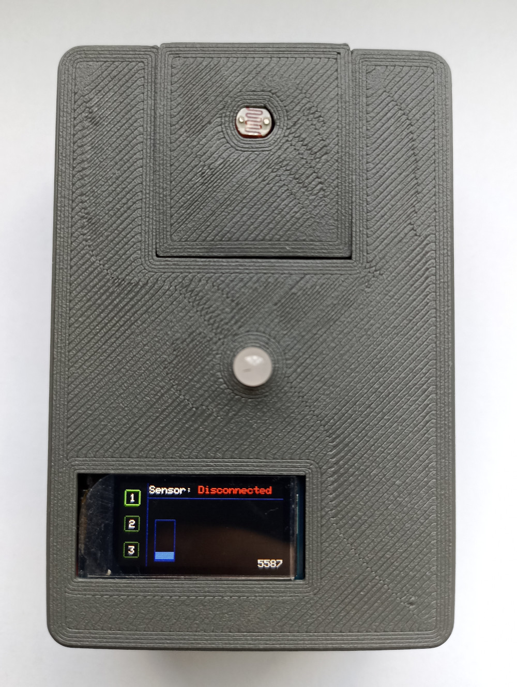
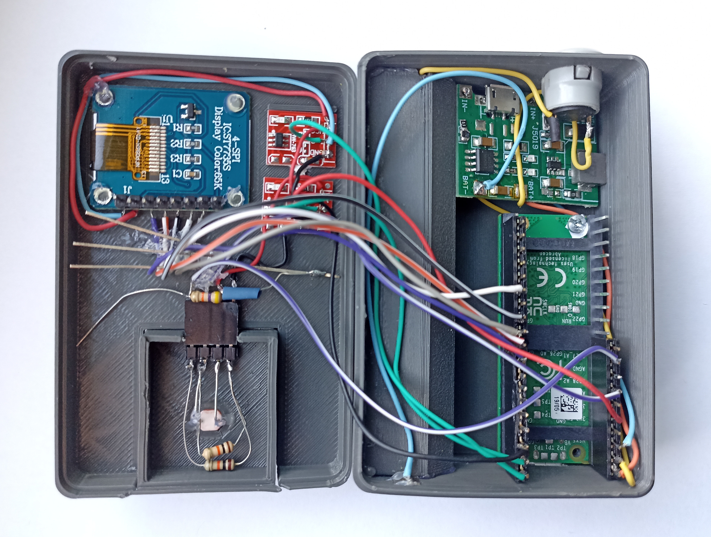

# BLu
Blu is a small battery powered, Bluetooth device which can interface with many sensors via hot-swappable socket and visualize the readings with RGB LED and TFT screen. It also has a dedicated Android app - [BLu Connect](https://github.com/MrMati/BLu-Connect).

## Main components
- Raspberry Pi Pico W
- TP4056 Li-Ion charger IC on J5019 module
- 0.96″ ST7735 TFT
- two TTP223 touch sensors
- RGB led

BLu uses custom version of [MicroPython](https://github.com/MrMati/micropython-blu) running the main Python [firmware](https://github.com/MrMati/BLu-firmware) which handles Bluetooth and main functionality.
UI/TFT drawing is implemented in C++ inside MicroPython fork, it uses custom version of [TFT_eSPI](https://github.com/MrMati/TFT_eSPI-pico) and runs on second core of RP2040.

The main point behind decision to use Python was a great reduction of Bluetooth code complexity compared to using BTStack directly, as Python provides two more layers of abstraction on top of it: [bluetooth](https://docs.micropython.org/en/latest/library/bluetooth.html) and [aioble](https://github.com/micropython/micropython-lib/blob/master/micropython/bluetooth/aioble/README.md).

The encosure for BLu was designed in Fusion360 and it was the first enclosure I ever designed. However the two biggest parts went out great on the first try.
It was printed with PLA on Creality Ender 3 Pro. The deformations of the sensor plug are caused by excessive usage of a hot air gun while gluing the connector.

## Finished "product"

## Mistakes have been made

I should have though more about the wiring.
The v2, *which will probably never be built*, should have a one or two connectors which would replace all the wires going between the two halves and also keep the two halves together like snaps.

## Genesis
This project started with a simple idea - to create a battery powered and Bluetooth capable device with proper enclosure which *at least* seems to be a finished product. Yes that's right, the plan didn't include any concrete functionality, because having it wouldn't make me learn anything more and would just slow the project down.

